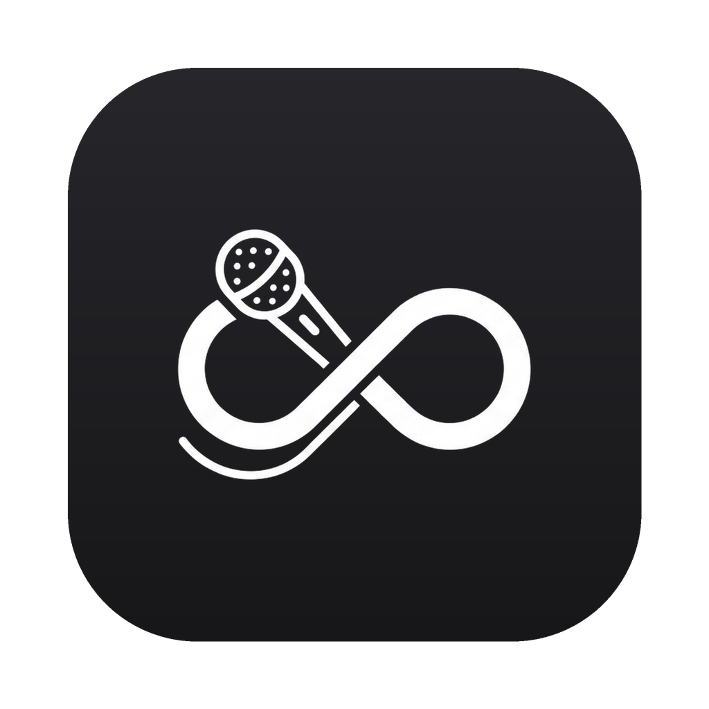

<div align="center">



# 言壤 · VoiceLog

**本地实时语音日志**

随身麦克风 → 本地 Whisper 实时转写 → Markdown 笔记<br>
<sub>音频绝不写盘 · 文字永不上传 · 全本地 · 不联网 · 零成本</sub>

<br>

[](LICENSE)
[](#下载安装)
[](https://github.com/zhaozimin/VoxTerra/releases/latest)
[](https://github.com/zhaozimin/VoxTerra/releases)
[](#下载安装)

<br>

[下载安装](#下载安装) · [特性](#特性) · [系统要求](#系统要求) · [配置](#配置) · [隐私](#隐私) · [从源码运行](#从源码运行) · [打包成 App](#打包成-app)

</div>

---

<div align="center">

把一整天随口说的话，自动变成带时间戳的文字日志，落进你自己的文件夹（可接 Obsidian）。<br>
全程在本机 Apple Silicon 上跑，不联网、不烧 API、零成本。常驻 macOS 菜单栏，安静工作。

</div>

## 下载安装

<div align="center">

[](https://github.com/zhaozimin/VoxTerra/releases/latest/download/VoiceLog-macOS.dmg)
&nbsp;&nbsp;
[](https://github.com/zhaozimin/VoxTerra/releases/latest/download/VoiceLog-Windows.exe)

<sub>每个平台只发一个固定名文件，链接永远指向最新版 · [全部发布](https://github.com/zhaozimin/VoxTerra/releases) · [手动下载模型（离线用）](https://github.com/zhaozimin/VoxTerra/releases/tag/models)</sub>

</div>

| 平台 | 直连下载 | 说明 |
|:--|:--|:--|
| **macOS** <br><sub>Apple Silicon · 13+</sub> | [`VoiceLog-macOS.dmg`](https://github.com/zhaozimin/VoxTerra/releases/latest/download/VoiceLog-macOS.dmg) | **已通过 Apple 公证**。双击 → 拖进「应用程序」→ 启动后允许麦克风 → 常驻菜单栏（无 Dock）。开机自启到「系统设置 → 登录项」添加。 |
| **Windows** <br><sub>x64 · Beta 实验版</sub> | [`VoiceLog-Windows.exe`](https://github.com/zhaozimin/VoxTerra/releases/latest/download/VoiceLog-Windows.exe) | 未签名，首次启动 SmartScreen 拦截时点「更多信息 → 仍要运行」。 |

> [!TIP]
> 首次启动需联网下载一次语音模型（约 1.5G），**从本仓库 GitHub Release 拉取，绕开 HuggingFace、国内可达**；之后全程离线即用。也可提前从 [`models`](https://github.com/zhaozimin/VoxTerra/releases/tag/models) 手动下载，放进应用的 `models` 目录。

> [!WARNING]
> **Windows 是实验版**：开发者无 Windows 真机，仅 CI 构建、未经运行验证。介意稳定性请优先用 macOS 版，限制说明见 [`packaging/windows/PORT_PLAN.md`](packaging/windows/PORT_PLAN.md)。

## 特性

<table>
<tr>
<td width="50%" valign="top">

#### 全本地 / 零成本
转写跑在本机 MLX 上，不调任何云端 API，断网照跑。

</td>
<td width="50%" valign="top">

#### 隐私优先
音频转写完即丢、**从不写盘**；文字只进你的本地文件夹、**永不上传**。

</td>
</tr>
<tr>
<td width="50%" valign="top">

#### 整句转写
Silero VAD 按「一句话」切分，停顿即落字，日志干净有标点（非逐字流式）。

</td>
<td width="50%" valign="top">

#### 菜单栏常驻
无 Dock 图标、不抢前台。计数 / 暂停 / 打开笔记 / 切时区 / 改保存位置。

</td>
</tr>
<tr>
<td width="50%" valign="top">

#### 专名识别增强
术语偏置（`initial_prompt`）+ 词边界纠错（`replace`）+ 幻觉过滤，治「Claude→Cloud」。

</td>
<td width="50%" valign="top">

#### 时区随切
全球飞，菜单栏点一下换时区，时间戳与「当天」立刻跟上。

</td>
</tr>
<tr>
<td colspan="2" valign="top">

#### 掉盘不丢字
输出目录在外置盘上、盘掉线时，自动回退内置盘，菜单栏橙点提示。

</td>
</tr>
</table>

## 系统要求

- **Apple Silicon Mac**（M 系列）+ macOS
- **Python ≥ 3.10** — 安装脚本会用 `uv` 自动准备一个 hermetic 3.12
- **一支麦克风** — 任何输入设备都行

## 配置

全部配置集中在 [`voicelog/config.yaml`](voicelog/config.example.yaml)，七行说清一切：

| 键 | 作用 |
|:--|:--|
| `vault_path` | 文字稿保存目录（菜单栏「保存位置」可随时改） |
| `model` | 本地模型目录绝对路径（最稳），或 HF 仓库名（联网下载） |
| `timezone` / `timezone_choices` | 时区与菜单栏候选（留空 = 跟随系统） |
| `input_device` | 麦克风：`null` = 默认 / 编号 / 名字片段 |
| `initial_prompt` | 术语偏置表（抬高专名先验，压繁体） |
| `replace` | 精确纠错（ASCII 词按词边界，不误伤） |
| `fallback_path` | 外置盘掉线时的内置回退目录 |

## 隐私

音频只在内存中转写、转完即弃，**不产生任何 `.wav`**；文字只写入你本地的笔记文件夹。唯一的联网，是首次下载模型权重，以及你主动点「检查更新」时。

> [!IMPORTANT]
> **「夜间整理」是手动配方，不是内置功能。**
> 笔记本就是纯 Markdown。你想用云端 Claude 把当天文字整理成日志 / 推文时，自己打开当天笔记、连同 [`voicelog/claude_prompt.md`](voicelog/claude_prompt.md) 贴给 Claude 即可。这一步**完全由你手动发起**——核心录音转写永远在本地、绝不自动上传。

## 从源码运行

面向开发者。

```bash
git clone https://github.com/zhaozimin/VoxTerra.git
cd VoxTerra
cp voicelog/config.example.yaml voicelog/config.yaml   # 按需改配置
bash voicelog/install.sh
```

装完两步手动收尾：

1. **授予麦克风权限** — 前台跑一次主程序，在系统弹窗里允许。
2. **启用后台自启** — `launchctl load` 装载守护进程。

详见 [`voicelog/README.md`](voicelog/README.md)。

<details>
<summary><b>自己打安装包</b></summary>

<br>

```bash
bash packaging/macos/build.sh      # 打包（需 Developer ID 证书）
bash packaging/macos/notarize.sh   # 公证（需 Apple ID 专用密码）
```

</details>

## 打包成 App

`.app` 双击即用：**PyInstaller 打包 + Developer ID 签名 + Apple 公证 → `.dmg`**。

配置、日志、声纹落在 `~/Library/Application Support/VoiceLog`（bundle 只读、签名安全）。脚本见 [`packaging/macos/`](packaging/macos)，Windows 移植蓝图见 [`packaging/windows/PORT_PLAN.md`](packaging/windows/PORT_PLAN.md)。

## License

[MIT](LICENSE) © 2026 zhaozimin

<div align="center">

<br>

<sub>**技术栈** — Apple Silicon · MLX · mlx-whisper large-v3 · Silero VAD · SpeechBrain ECAPA 声纹 · Python 3.12 · SwiftUI</sub>

<br>

<sub><a href="https://github.com/zhaozimin/VoxTerra">github.com/zhaozimin/VoxTerra</a> · 言壤 · VoiceLog — 说出来，留下来，留在本地。</sub>

</div>
